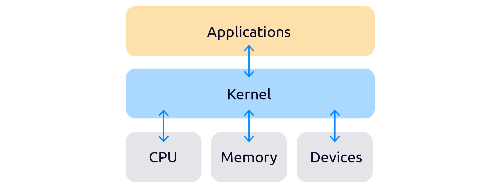
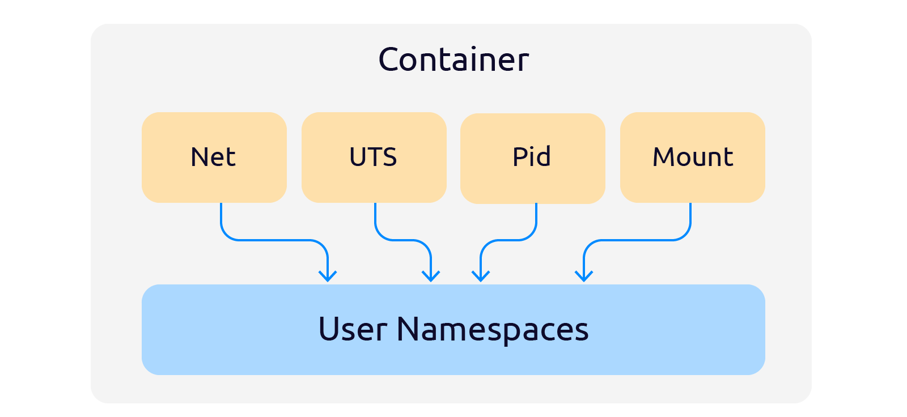
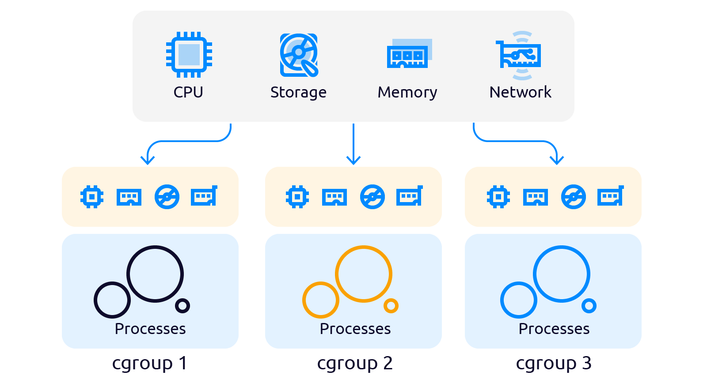
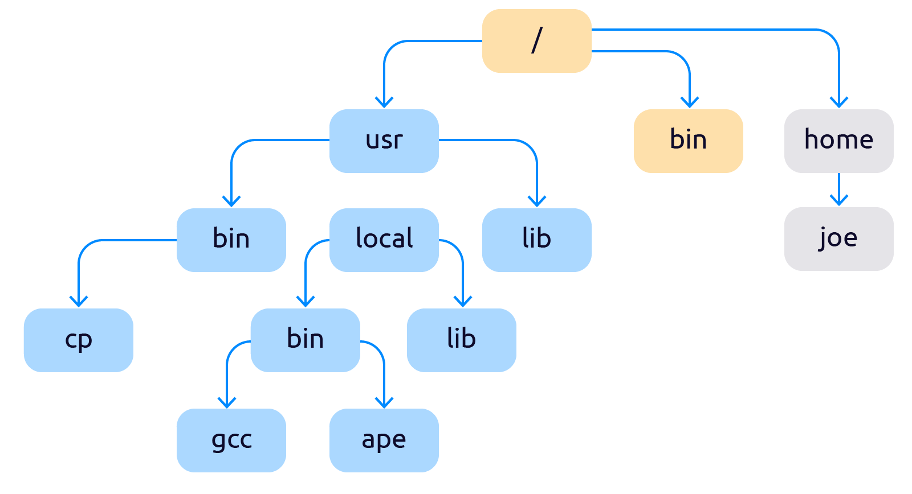
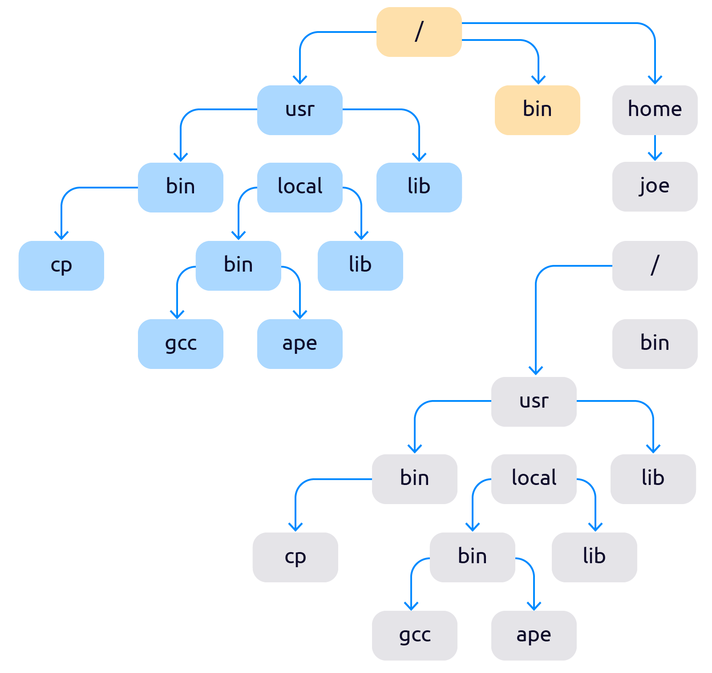

# Контейнеризация

Контейнеризация (виртуализация на уровне операционной системы, контейнерная виртуализация, зонная виртуализация[1]) —
метод виртуализации, при котором ядро операционной системы поддерживает несколько изолированных экземпляров пространства
пользователя вместо одного. Эти экземпляры (обычно называемые контейнерами или зонами) с точки зрения выполняемых в них
процессов идентичны отдельному экземпляру операционной системы. Для систем на базе Unix эта технология похожа на
улучшенную реализацию механизма **chroot**. Ядро обеспечивает полную изолированность контейнеров, поэтому программы из
разных контейнеров не могут воздействовать друг на друга.

### Основа контейнеризации — ядро Linux

Контейнер — это изолированная рабочая среда, содержащая все зависимости, конфигурационные и исполняемые файлы
необходимые для работы программы или пользователя, находящегося в контейнере. Для работы контейнера ОС выделяет пул
изолированных ресурсов: ядра ЦП, оперативная память, диск и сеть.

Пока в Linux существуют всего несколько инструментов ядра, которыми можно изолировать процессы и ограничить доступ к
ресурсам. С помощью **Namespaces** (неймспейсы) процессы можно объединить в группы и изолировать, а с помощью
**Cgroups** можно задать лимиты по ресурсам.

Способы изоляции в Linux:

- Namespace + Cgroups
- Chroot

### Современный мехнаизм изоляции процессов

**Namespace** — механизм изоляции процессов. Мы можем создавать пространства имён процессов (группы процессов) помещать
туда нужные нам процессы по их идентификаторам — пидам (PID) и эти процессы не могут обращаться к процессам вне своего
пространства имён.

**Cgroups(Control groups)** — механизм определения количества выдаваемых ресурсов процессам.

- [Namespaces](https://ru.wikipedia.org/wiki/Пространство_имён_(программирование)) решают вопросы изоляции;
- [Cgroups](https://ru.wikipedia.org/wiki/Контрольная_группа_(Linux)) решаеют вопросы ограничения ресурсов для
  изолированных процессов.

Ограничение ресурсов - Cgroups

### Первый механизм изоляции процессов — chroot

Chroot — это подмена корня файловой системы для группы процессов или временная смена корня и контекста для запуска
выбранных процессов.
Точнее сказать так: chroot добавляет в систему второй корневой каталог «/», который с точки зрения пользователя ничем не
будет отличаться от первого.

Первый механизм изоляции процессов — chroot

После применения чрута файловая система начинает выглядеть как-то так:

**Контейнеризация** не подходит, если для работы приложения требуется другая ОС, а не та, что установлена на сервере.

### Реализации:

- [Docker](https://ru.wikipedia.org/wiki/Docker) (Namespace + cgroups)
- [LXC](https://ru.wikipedia.org/wiki/LXC) (Namespace + cgroups)
- [Solaris Containers](https://ru.wikipedia.org/wiki/Solaris_Containers)
- [FreeVPS](https://ru.wikipedia.org/w/index.php?title=FreeVPS&action=edit&redlink=1)
- [OpenVZ](https://ru.wikipedia.org/wiki/OpenVZ)
- [Virtuozzo Containers](https://ru.wikipedia.org/wiki/Virtuozzo)
- [FreeBSD Jail](https://ru.wikipedia.org/wiki/FreeBSD_Jail)  (chroot)
- [chroot](https://ru.wikipedia.org/wiki/Chroot) (Первый механизм контейнеризации)

### Ссылки:

- [История контейнеризации](https://1cloud.ru/blog/container_history)